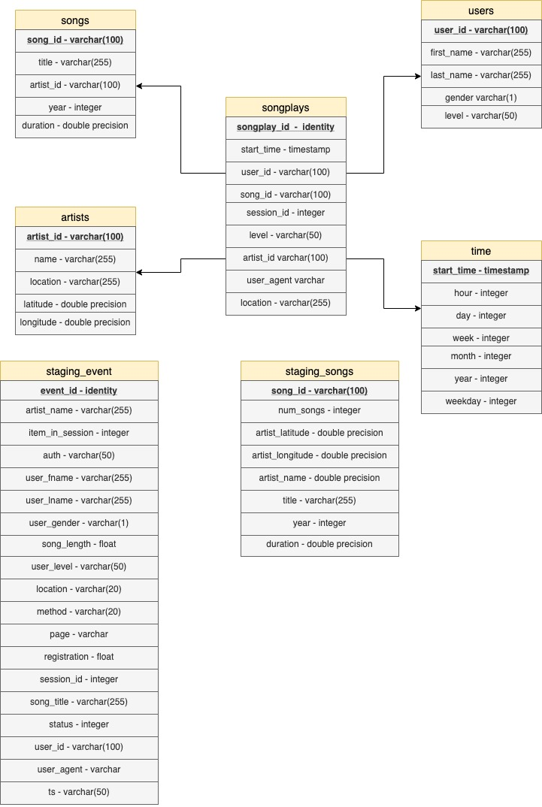

# Intro - Analysis with S3 and Redshift
--------------------------------------------

The startup called Sparkify has grown their songs & users database. The sparkify team want to move their processes and data into the cloud-based. Sparkify data sources are provided by two public 'S3 buckets'. Their data storaged in dire of JSON logs on user activity on the app. The Redshift service is where data will be ingested and transformed,in fact though COPY command we will access to the JSON files inside the buckets and copy their content on our staging tables. In this project we are going to use two Amazon Web Services,[S3](https://aws.amazon.com/en/s3/) (Data storage) & [Redshift](https://aws.amazon.com/en/redshift/) (Data warehouse with)

--------------------------------------------
#### Schema definition
##### This is the schema of the database 
* If the field is underlined means that is a primary key

--------------------------------------------

#### Project structure
##### This project contains some important files:
1. dhw.cfg -  Configuration file used that contains info about Redshift, IAM and S3.
2. create_tables.py - The file of create have a two function one called 'create_tables' and 'drop_tables' which python script of creating and droping the table.
2. sql_querys.py - This file contains variables with SQL statement in String formats, partitioned by CREATE, DROP, COPY and INSERT statements
3. etl.py - This file is a python script to handle the way of copy json data from log files to staging tables and other tables. 
4. IaC.ipyn - The steps of infrastructure as code to create and define a IAM & Cluster obj. 

--------------------------------------------
#### ETL process
##### In this project most of ETL is done with SQL (Python used just as bridge), transformation and data normalization is done by Query, check out the ``sql_queries`` python module

--------------------------------------------
#### How to run
Although the data-sources are provided by two ['S3 buckets'](https://aws.amazon.com/en/s3/) the only thing you need for running the example is an ['AWS Redshift Cluster'](https://aws.amazon.com/en/redshift/) up and running

--------------------------------------------
#### Notes
* In this example a redshift dc2.large cluster with 4 nodes has been created, with a cost of USD 0.25 per hour. 
* Also in this example I used 'IAM role' authorization mechanism, the only policy attached to 'IAM role' is 'AmazonS3ReadOnlyAccess'
* DON'T FORGET TO DELETE YOUR CLUSTER CAUSE THAT WILL COST YOU MORE. BE CAREFUL, PLEASE. 

